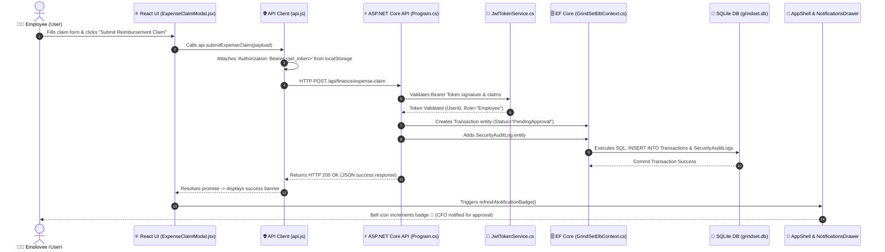

# 🏗️ GrindSet ERP - Full System Architecture & Request Lifecycle

This document provides a comprehensive end-to-end guide to the architecture and request execution lifecycle of the **GrindSet 3-Tier Enterprise ERP Platform**. It covers how data flows across all layers: from the **React Frontend UI**, through the **API Client & JWT Bearer Interceptor**, into **ASP.NET Core Minimal API Endpoints**, processed by **EF Core ORM**, persisted inside **SQLite (`grindset.db`)**, and reflected back to **Real-Time Role-Aware Notifications**.

---

## 🔄 End-to-End Request Lifecycle Sequence

Below is the complete sequence diagram illustrating the lifecycle of an action (e.g., submitting an employee expense reimbursement claim):



---

## 📁 Detailed Step-by-Step Execution Trail

### 1. User Action in React UI Layer
- **Primary Files**:
  - [ExpenseClaimModal.jsx](file:///c:/Users/PC/Desktop/3.2/GrindSet/GrindSet-ERP/frontend/src/components/ExpenseClaimModal.jsx)
  - [FinancePage.jsx](file:///c:/Users/PC/Desktop/3.2/GrindSet/GrindSet-ERP/frontend/src/pages/FinancePage.jsx)
- **What Happens**:
  1. The user interacts with form controls (select dropdowns, input text, currency amounts).
  2. The form's `handleSubmit(e)` handler constructs a JSON payload containing target account ID, claim category, expense amount, and notes.
  3. The component dispatches an asynchronous call to the central API wrapper:
     ```javascript
     const payload = {
       accountId: parseInt(accountId),
       employeeId: user?.userId,
       type: expenseType,
       amount: parseFloat(amount),
       note: note.trim()
     };
     await api.submitExpenseClaim(payload);
     ```

---

### 2. Frontend API Client & JWT Interceptor Layer
- **Primary File**: [api.js](file:///c:/Users/PC/Desktop/3.2/GrindSet/GrindSet-ERP/frontend/src/config/api.js)
- **What Happens**:
  1. `apiFetch()` reads the current session's JWT token from `localStorage.getItem('grindset_token')`.
  2. Automatically constructs an HTTP `Authorization: Bearer <token>` header along with `Content-Type: application/json`.
  3. Sends an HTTP `POST` request to `http://localhost:5000/api/finance/expense-claim`.

---

### 3. ASP.NET Core Routing & JWT Authentication Middleware
- **Primary Files**:
  - Middleware & Minimal API Routes: [Program.cs](file:///c:/Users/PC/Desktop/3.2/GrindSet/GrindSet-ERP/backend/GrindSet.Api/Program.cs)
  - Token Signature Issuer: [JwtTokenService.cs](file:///c:/Users/PC/Desktop/3.2/GrindSet/GrindSet-ERP/backend/GrindSet.Api/Services/JwtTokenService.cs)
- **What Happens**:
  1. `app.UseAuthentication()` intercepts the request and verifies the HMAC SHA-256 secret key signature via `JwtBearerDefaults`.
  2. If valid, identity claims (`UserId`, `Role`, `ApprovalStatus`) are attached to the `HttpContext.User`.
  3. The request routes to the Minimal API handler:
     ```csharp
     app.MapPost("/api/finance/expense-claim", async (GrindSetDbContext db, ExpenseClaimDto dto) =>
     {
         var tx = new Transaction
         {
             AccountId = dto.AccountId,
             LoggedByEmployeeId = dto.EmployeeId,
             Type = dto.Type,
             Amount = dto.Amount,
             Status = "PendingApproval",
             Note = dto.Note,
             TransactionDate = DateTime.UtcNow
         };
         db.Transactions.Add(tx);
         ...
     ```

---

### 4. Entity Framework Core ORM & SQLite Persistence
- **Primary Files**:
  - C# Entity Model: [Transaction.cs](file:///c:/Users/PC/Desktop/3.2/GrindSet/GrindSet-ERP/backend/GrindSet.Api/Models/Transaction.cs)
  - DbContext: [GrindSetDbContext.cs](file:///c:/Users/PC/Desktop/3.2/GrindSet/GrindSet-ERP/backend/GrindSet.Api/Data/GrindSetDbContext.cs)
  - SQLite Database: `grindset.db`
- **What Happens**:
  1. EF Core tracks entity mutations in the change tracker.
  2. An entry is added to `SecurityAuditLogs` (`Action = "SUBMIT_EXPENSE_CLAIM"`).
  3. `await db.SaveChangesAsync()` executes parameterized SQL inside `grindset.db`:
     ```sql
     INSERT INTO "Transactions" ("AccountId", "LoggedByEmployeeId", "Type", "Amount", "Status", "Note", "TransactionDate")
     VALUES (@p0, @p1, @p2, @p3, 'PendingApproval', @p4, @p5);
     ```

---

### 5. API Response & Real-Time Notification Bell Sync
- **Primary Files**:
  - Header & Bell Badge: [AppShell.jsx](file:///c:/Users/PC/Desktop/3.2/GrindSet/GrindSet-ERP/frontend/src/components/AppShell.jsx)
  - Notification Drawer: [NotificationsDrawer.jsx](file:///c:/Users/PC/Desktop/3.2/GrindSet/GrindSet-ERP/frontend/src/components/NotificationsDrawer.jsx)
- **What Happens**:
  1. The API returns `Results.Ok(new { message = "Expense claim submitted...", transaction })` with HTTP `200 OK`.
  2. React UI resolves the promise, updates local state, and calls `loadFinanceData()`.
  3. `AppShell.jsx` triggers `refreshNotificationBadge()`.
  4. For the **Company Owner (CFO)**, the notification bell (`🔔`) increments its unread count.
  5. The CFO opens [NotificationsDrawer.jsx](file:///c:/Users/PC/Desktop/3.2/GrindSet/GrindSet-ERP/frontend/src/components/NotificationsDrawer.jsx) and sees a 1-click **Approve Now** button which dispatches `POST /api/finance/approve-expense/{id}`, automatically deducting the money from the financial account balance and updating the claim status to `Approved`.

---

## 🛠️ Summary Matrix of System Components & File Map

| Component / Layer | Primary File | Responsibilities |
| :--- | :--- | :--- |
| **Frontend Layout Shell** | [AppShell.jsx](file:///c:/Users/PC/Desktop/3.2/GrindSet/GrindSet-ERP/frontend/src/components/AppShell.jsx) | Navigation bar, theme toggle, header search (`Ctrl+K`), `+ New` launcher, notification bell count |
| **Finance Subsystem** | [FinancePage.jsx](file:///c:/Users/PC/Desktop/3.2/GrindSet/GrindSet-ERP/frontend/src/pages/FinancePage.jsx) | Multi-project finance hub, project budget scope selector, project-isolated ledgers, CSV exporter |
| **Project Management** | [ProjectsPage.jsx](file:///c:/Users/PC/Desktop/3.2/GrindSet/GrindSet-ERP/frontend/src/pages/ProjectsPage.jsx) | Portfolio cards view, quarterly epic roadmap timeline view (Q1-Q4), lightweight sprint Kanban board |
| **Project Detail Inspector** | [ProjectDetailModal.jsx](file:///c:/Users/PC/Desktop/3.2/GrindSet/GrindSet-ERP/frontend/src/components/ProjectDetailModal.jsx) | Slide-out metadata inspector for project scope, strategic objectives, operating accounts, and sprint tasks |
| **Notification Center** | [NotificationsDrawer.jsx](file:///c:/Users/PC/Desktop/3.2/GrindSet/GrindSet-ERP/frontend/src/components/NotificationsDrawer.jsx) | Role-aware notification event drawer for Employee, Company Owner, and Admin with 1-click actions |
| **API Client & Interceptor** | [api.js](file:///c:/Users/PC/Desktop/3.2/GrindSet/GrindSet-ERP/frontend/src/config/api.js) | Central fetch wrapper, JWT Bearer token auto-injection, error parsing |
| **Backend REST API** | [Program.cs](file:///c:/Users/PC/Desktop/3.2/GrindSet/GrindSet-ERP/backend/GrindSet.Api/Program.cs) | ASP.NET Core Minimal API endpoints, CORS, route handlers, DTO definitions |
| **Security & Auth** | [JwtTokenService.cs](file:///c:/Users/PC/Desktop/3.2/GrindSet/GrindSet-ERP/backend/GrindSet.Api/Services/JwtTokenService.cs) | HMAC SHA-256 JWT token generation, cryptographic claim signing |
| **Database Context** | [GrindSetDbContext.cs](file:///c:/Users/PC/Desktop/3.2/GrindSet/GrindSet-ERP/backend/GrindSet.Api/Data/GrindSetDbContext.cs) | Entity Framework Core database context mapping 20 ERD entities |
| **Database Initializer** | [DbInitializer.cs](file:///c:/Users/PC/Desktop/3.2/GrindSet/GrindSet-ERP/backend/GrindSet.Api/Data/DbInitializer.cs) | SQLite database creation & seeding 3 enterprise projects, 8 accounts, transactions, and reallocations |
